#+OPTIONS: toc:nil num:nil
#+OPTIONS: author:nil date:nil
#+REVEAL_TITLE_SLIDE:
#+REVEAL_INIT_OPTIONS: width:"100%", height:"100%", margin:0.0, minScale:1, maxScale:1, pdfMaxPagesPerSlide:1
#+REVEAL_EXTRA_CSS: ./reveal-fit.css
#+REVEAL_EXTRA_CSS: ./reveal-wrap.css

* TPMS
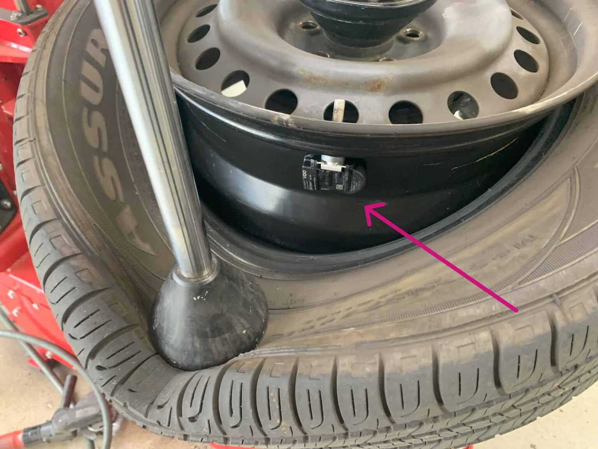

Lovpligtigt i nye biler siden 2014.

* Bølgelængde
# #+ATTR_HTML: :style display:block; margin:0 auto; max-width:100%; max-height:92vh;
# #+ATTR_HTML: :style max-height:95vh;

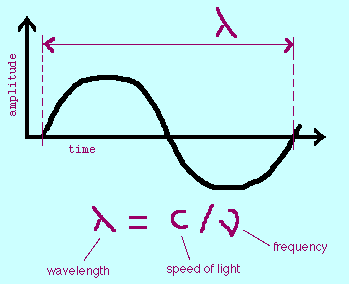

$\lambda = \frac{299e6 \,m/s}{460e6 \,Hz}=0.65m$

dipol, ½\lambda:
$\frac{0.65m}{2\cdot2} \cdot95\% = 15cm$

* sdrpp demo
460MHz

* Skrotpladsen
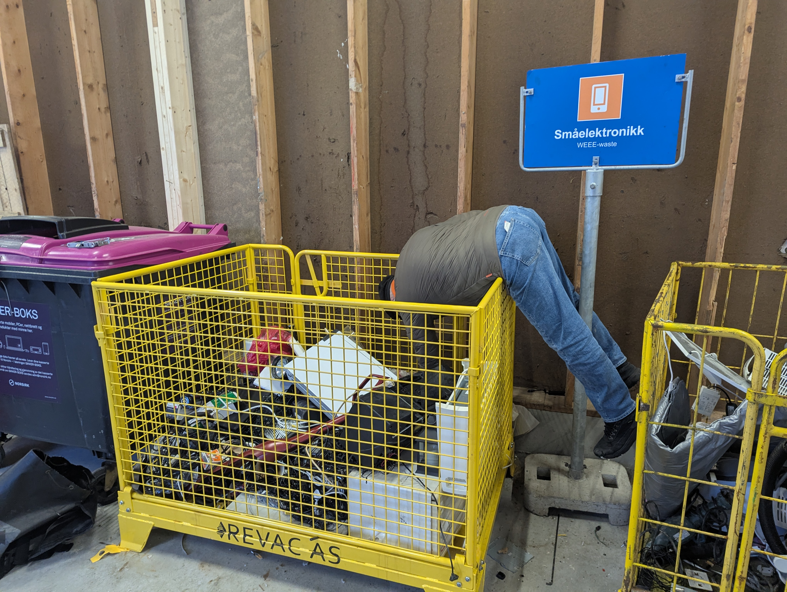

* Intermezzo
Ski-holder fra miljøpladsen
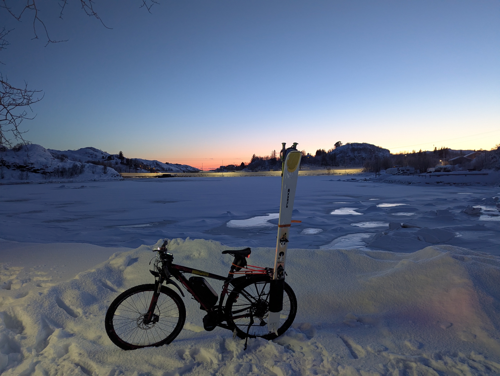

* 433MHz heatmap
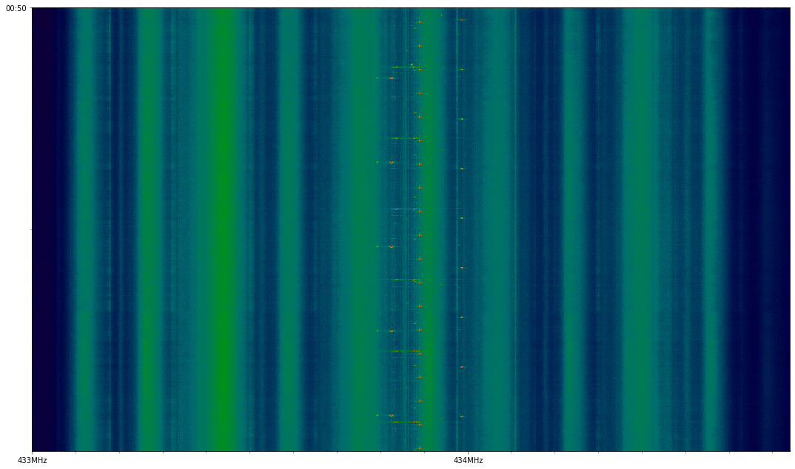

* Magnetisk -> Elektrisk energi

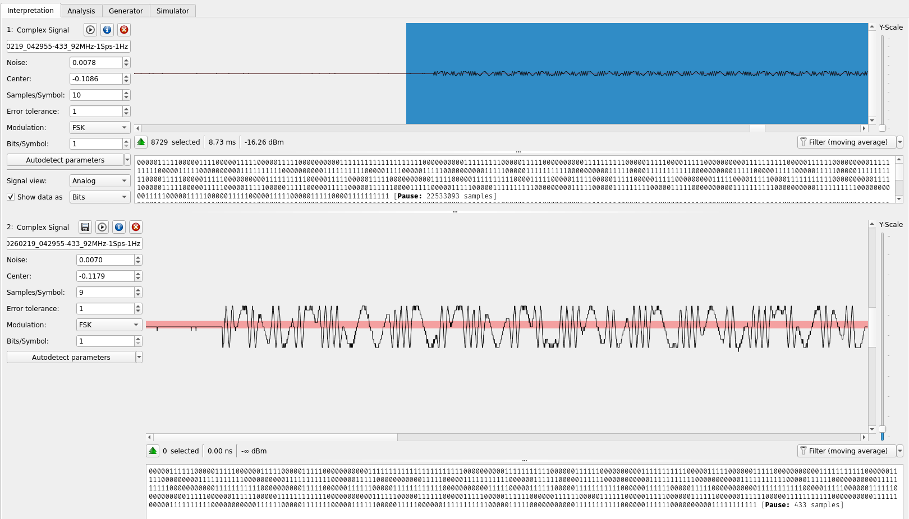

* Decode

#+begin_src json
{"time" : "2026-02-19T22:05:37", "model" : "Toyota", "type" : "TPMS", "id" : "d9b796c4", "status" : 128, "pressure_PSI" : 30.000, "temperature_C" : -2.000, "mic" : "CRC", "mod" : "FSK", "freq1" : 433.930, "freq2" : 433.887, "rssi" : -0.138, "snr" : 22.512, "noise" : -22.650}
#+end_src

* Overvågning på parkeringspladsen

[[file:antenne-parkering.jpg]]

* Tilbage på værelset
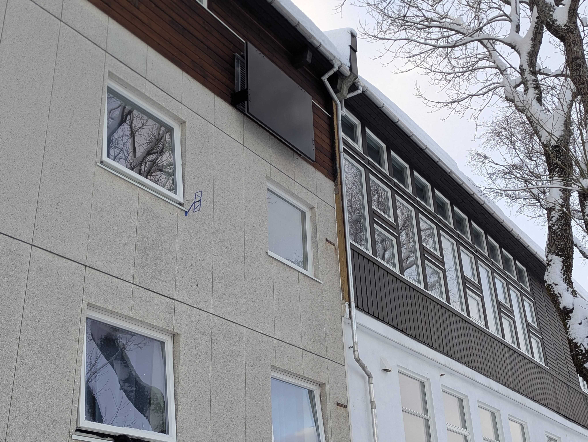

* Optag alt
499 unikke ID

#+begin_src conf
  32356 Acurite-606TX   253     2
  23750 Bresser-3CH     251     1
  14868 Nexus-TH        164     1
  12941 Toyota  d9b796c4
  12839 Toyota  d9b79970
  12815 Toyota  d9bd4f7c
  12395 Toyota  d9b7401b
   9481 Bresser-3CH     75      1
   7777 Toyota  d37bb93f
   7259 Acurite-606TX   253     1
   5355 Cotech-367959   161
   2849 Toyota  d45539f3
   1773 Toyota  d34501f7
    974 Toyota  d45524a7
    868 Nexus-TH        75      1
    514 Toyota  d34511b9
    336 Toyota  d4552503
    284 Toyota  d34501b3
    271 Toyota  d33e1c81
    256 KlikAanKlikUit-Switch   15627662
    255 Proove-Security 15627662        1
    255 Nexa-Security   15627662        1
    244 Toyota  db536e08
    238 Proove-Security 60085913        3
    238 Nexa-Security   60085913        3
    238 KlikAanKlikUit-Switch   60085913
    211 Toyota  db536e87
    202 Proove-Security 39104350        3
    202 Nexa-Security   39104350        3
    202 KlikAanKlikUit-Switch   39104350
    201 Proove-Security 41313801        3
    201 Nexa-Security   41313801        3
    201 KlikAanKlikUit-Switch   41313801
    199 Toyota  da1dc469
    139 Ford    017e35a7
    126 Nexus-TH        251     1
    119 Renault da1e43
    118 Toyota  d5fe88b5
    118 Toyota  d455250f
    118 Ford    017e3643
    115 Ford    017e440b
    103 Ford    017e35a0
     88 Renault da1385
     86 Toyota  da0a145d
     81 Toyota  da4c5667
     80 Toyota  db67c2c5
     80 Toyota  d5f9fbe4
     72 Toyota  db679e11
     72 Citroen 817e35a7
     71 Hyundai-VDO     93aba0ad
     68 Hyundai-VDO     817e35a0

#+end_src

# #+begin_src sh
# zcat -f tpms_current.jsonl* \
#       | jq -Rr 'fromjson? | select(.id? != null) | [(.model // "UNKNOWN"), (.id|tostring), (.channel)] | @tsv' \
#       | sort \
#       | uniq -c \
#       | sort -nr
#+end_# src

* Hvad er temperaturen
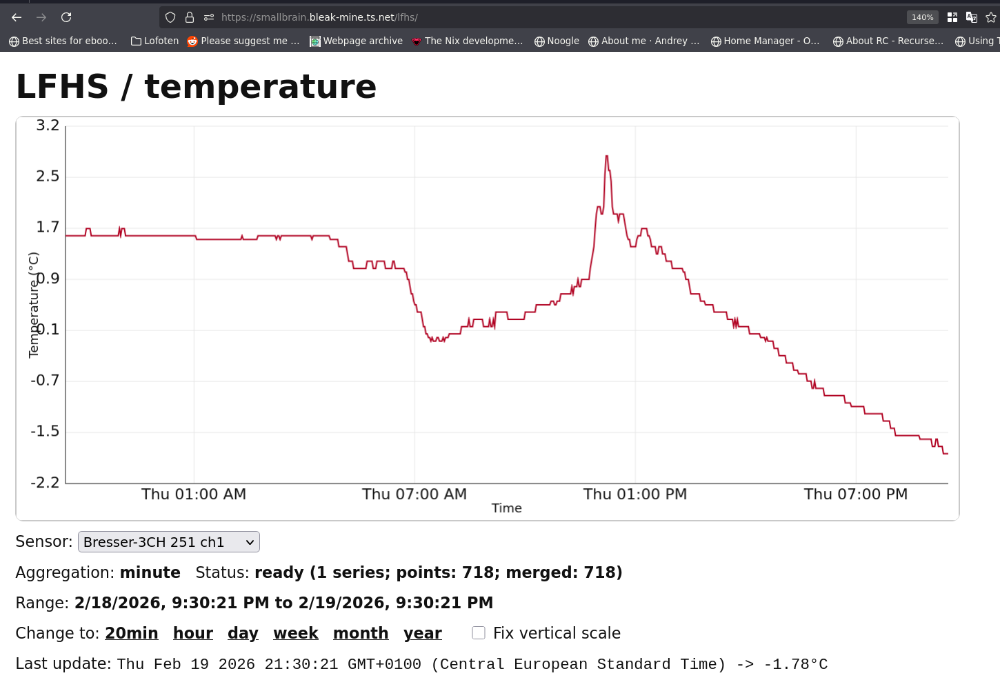
https://smallbrain.bleak-mine.ts.net/lfhs
* Hvad med bilen

[[file:bil-hjemme.png]]

: python tpms.py tpms_current.jsonl --id d9b79970 --id d9b7401b --id d9bd4f7c --id d9b796c4 --window-minutes 30 --show

* Dæktrykket

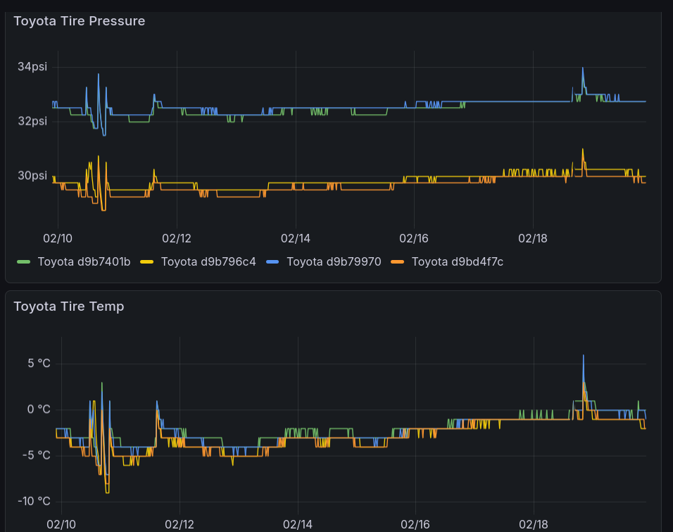

$pV = nRT$

https://smallbrain.bleak-mine.ts.net/grafana/d/g6h5m4/toyota?orgId=1&from=now-10d&to=now&timezone=browser

* bilen
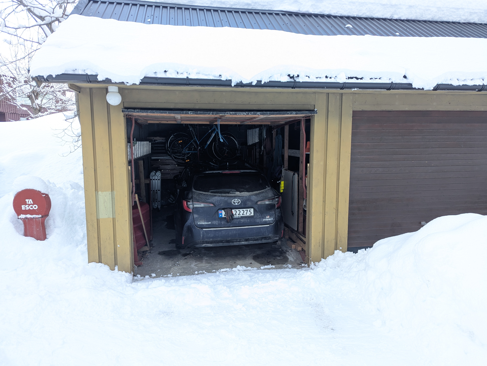

* Bornhack
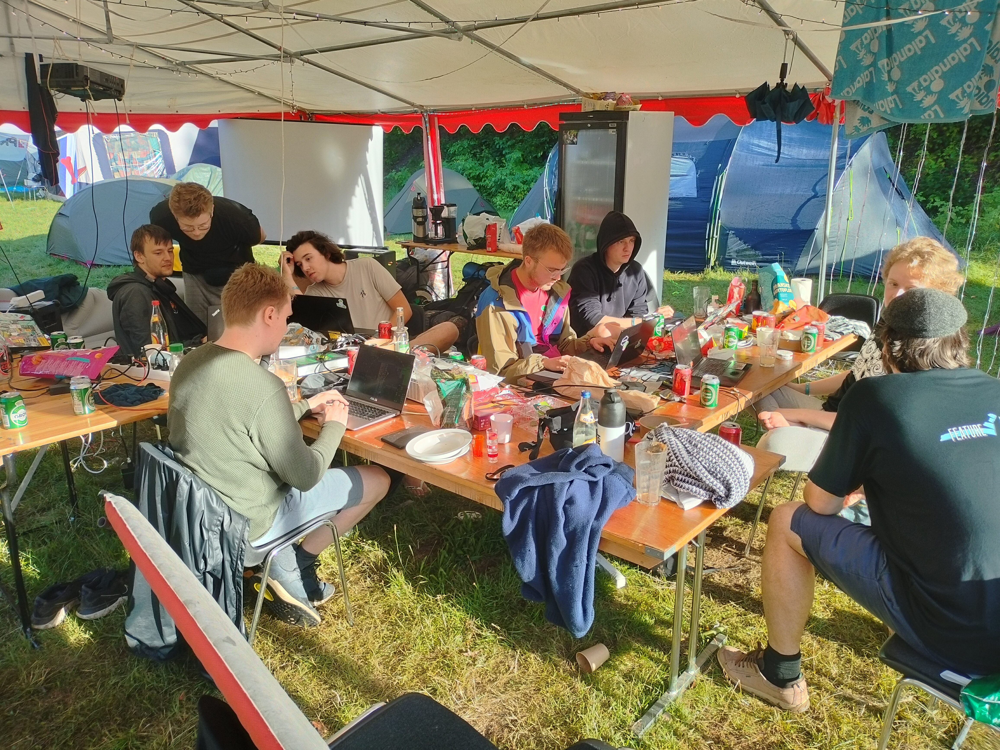

