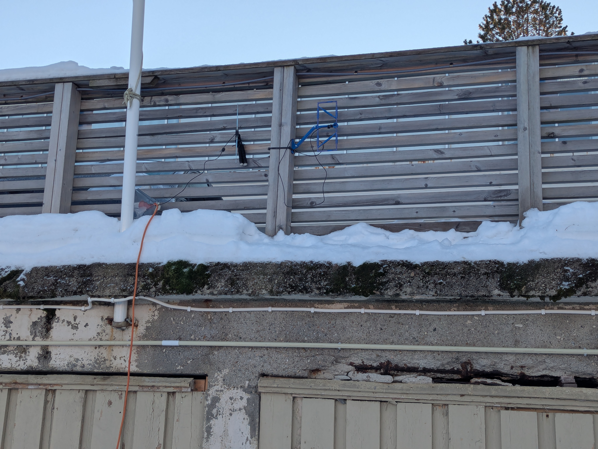
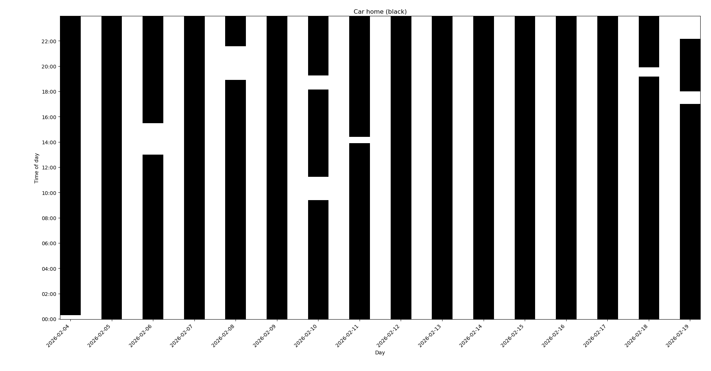

TPMS is a Tire Pressure Monitoring System, a small sensor and radio transmitter installed inside each tire on newer cars.

TPMS sends pressure and temperature data, and a unique ID, using 433MHz in Europe, to a computer in the car.
I collected TPMS signals from cars around LFHS using a 3d-printed antenna, sdr-dongle and Raspberry Pi running [[https://github.com/merbanan/rtl_433][rtl_433]], as an example of how signals can unwittingly be used for surveillance.

The antenna is a [[https://www.printables.com/model/1313116-split-tc3ec-433mhz-moxon-antenna-by-ta3trv][433MHz Moxon antenna]] which can be printed on a standard 3d printer and assembled using super glue and 1.5mm^2 solid copper wire, easily found in a scrapyard or electricity installation wire.

#+CAPTION: Antenna and Raspberry Pi, "hidden" close to the parking area

The decoded signals are both stored on the Pi as =jsonl= and sent to a server running Prometheus. The =jsonl= file(or =jsonl.gz=) can be processed by the [[file:tpms.py][tpms.py]] script.

#+begin_src sh
python tpms.py '/var/log/rtl_433/tpms/tpms_current.jsonl-2026-01-*.gz' \
  --start 2026-01-21 --end 2026-01-26 \
  --id 251 --window-minutes 40 --show
#+end_src

List individual sensors, by counting and sorting IDs,
#+begin_src sh
zcat -f /var/log/rtl_433/tpms/tpms_current.jsonl* \
  | jq -Rr 'fromjson? | select(.id? != null) | [(.model // "UNKNOWN"), (.id|tostring)] | @tsv' \
  | sort \
  | uniq -c \
  | sort -nr
#+end_src

Example of one of the neighbors car. The car is almost always home, indicated by the black bars.
#+CAPTION:

* Webpage
Home weather stations also transmits on 433MHz. There is a simple [[file:webpage/][webpage]] which shows the temperature, either from weather stations or the TPMS.
You will need to update the ID in [[file:webpage/index.html]]
: <option value='rtl433_temperature_c{model="Bresser-3CH",id="251",channel="1"}'>Bresser-3CH 251 ch1</option>

The data is pooled from Prometheus running on the same server that host the webpage, see [[file:webpage/app.js]]
: const PROM_RANGE = "/lfhs/prom/api/v1/query_range";

* Presentation

I did a short presentation at "Ord for dagen" at LFHS. See [[file:presentation/presentation.html]]

* TPMS stuff
Random commands

Install and force logrotate to test
#+begin_src sh
sudo ./install.sh
sudo logrotate -f /etc/logrotate.d/rtl433-tpms
sleep 2
sudo logrotate -f /etc/logrotate.d/rtl433-tpms
ls -1 /var/log/rtl_433/tpms | tail -n 10
#+end_src

Clean the =jsonl=
#+begin_src sh
grep --text -E '^\s*\{.*\}\s*$' all.jsonl > cleaned.jsonl
#+end_src

Combine all gzipped logfiles
#+begin_src sh
zcat -f /var/log/rtl-433/tpms/tpms_current.jsonl* > combined.jsonl
#+end_src

Or just some days
#+begin_src sh
zcat -f /var/log/rtl_433/tpms/tpms_current.jsonl-2026-01-{21..26}_*.gz > combined_2026-01-21_26.jsonl
#+end_src

Test prometheus exporter
#+begin_src sh
curl -s http://127.0.0.1:9123/metrics | grep rtl433_temperature_c | head
#+end_src

Export a whole =jsonl= to Prometheus
#+begin_src sh
python3 jsonl_to_openmetrics.py < /var/log/rtl_433/tpms/tpms_current.jsonl > backfill.om
nix shell nixpkgs#prometheus.cli
sudo -u prometheus promtool tsdb create-blocks-from openmetrics backfill.om /var/lib/prometheus2/data
#+end_src
